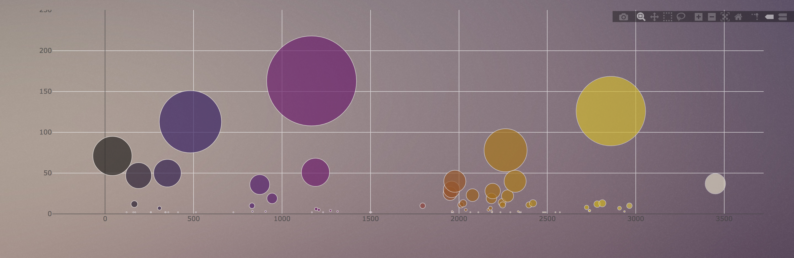

# BellyButtonBiodiversity



#### Description

[BellyButtonBiodiversity]() is web page created to explore the amazing diversity of cultured bacterias  with an interactive dashboards.

#### Methodology

1. ### Build Meta Data.
* `buildMetadata`  function was created to retrieve and display the data from route `"/metadata/<sample>"`. 

```javascript

function buildMetadata(sample) {
console.log("in buildMetadata:  ")
// @TODO: Complete the following function that builds the metadata panel
// Use `d3.json` to fetch the metadata for a sample
// Use d3 to select the panel with id of `#sample-metadata`
// Use `.html("") to clear any existing metadata
d3.select("#sample-metadata").html("");

// // Use `Object.entries` to add each key and value pair to the panel
var url = `/metadata/${sample}`;
console.log(url);
d3.json(url).then(function(response){
Object.entries(response).forEach(function(key){
console.log(key[0]);
console.log(key[1]);
var key1 = key[0];
var value1 = key[1];
d3.select("#sample-metadata").append("h5").text(`${key1}:${value1}`)})
});
}

```

2. ### Plotly.js.
Interactive dashboards were created using [Plotly Library](https://plot.ly/javascript/) for Javascript. Data was extractred from route  `"/samples/<sample>"` and displayed as a Pie and Bubble Charts.

```javascript

function buildCharts(sample) {
console.log("in buildCharts:  ")
d3.select("#pie").html("")
var url = `/samples/${sample}`;
d3.json(url).then(function(response) {
console.log(response.sample_values)
var data = [{
values: (response.sample_values).slice(0,10),
labels: (response.otu_ids).slice(0,10),
hoverinfo: (response.otu_labels).slice(0,10),
type: "pie",
hole: 0.5,
marker: {
line: {
color: 'white',
width: 3
}, 
}   
}];

var layout = {
paper_bgcolor:'rgba(0,0,0,0)',
plot_bgcolor:'rgba(0,0,0,0)',
// paper_bgcolor: "rgb(31,31,31)",
// plot_bgcolor: "rgb(31,31,31)",
title: `Top Sample Counts for ${sample}`
};

Plotly.newPlot("pie", data, layout);
});

d3.select("#bubble").html("")
var url = `/samples/${sample}`;
d3.json(url).then(function(response) {
console.log(response.sample_values)
const otu_ids = response.otu_ids
const sample_values = response.sample_values
const otu_labels = response.otu_labels
var data = [{
x: otu_ids,
y: sample_values ,
type: 'scatter',
mode:'markers',
text: otu_labels, 
name: `${sample}`, 
hoverinfo:'text+x+y+name',
marker: {
color: otu_ids,
size: sample_values,
colorscale: "Electric"
},
line: {
color: 'white',
width: 3}, 
}];

var layout = {
width:1450,
height:450,
paper_bgcolor:'rgba(0,0,0,0)',
plot_bgcolor:'rgba(0,0,0,0)',
margin: { t: 0 },
hovermode: 'closest',
title: "Interactive Dashboard",
yaxis: {title: 'sample_values'},
yaxis: {range: [0, 250]},
xaxis: {title: 'otu_ids'},
};

Plotly.newPlot("bubble", data, layout);
});
};

```
3. ###  Change Sample.
Sample to be displayed can be choosed from select options. Each time new option is selected, new graph and data will be displayed on the web page.

```html

<div class="jumbotron">
<h1>Belly Button Biodiversity</h1>
<p>explore biodiversity with interactive dashboards</p>
<div class="well">
<h5>SELECT:</h5>
<select id="selDataset" onchange="optionChanged(this.value)"></select>
</div>
```

```javascript

function init() {
console.log("in init section.")
// Grab a reference to the dropdown select element
var selector = d3.select("#selDataset");

// Use the list of sample names to populate the select options
d3.json("/names").then((sampleNames) => {
sampleNames.forEach((sample) => {
selector
.append("option")
.text(`Sample ${sample}`)
.property("value", sample);
});
```
```javascript
function optionChanged(newSample) {
console.log("in optionChanged:  ")
buildCharts(newSample);
buildMetadata(newSample);
}
```

* JavaScript files and Plotly Library were linked to the HTML file.
```html

<script src="https://cdnjs.cloudflare.com/ajax/libs/d3/5.5.0/d3.js"></script>
<script src="https://cdn.plot.ly/plotly-latest.min.js"></script>
<script src="{{ url_for('static', filename='js/bonus.js') }}"></script>
<script src="{{ url_for('static', filename='js/app.js') }}"></script>
```
4. ###  Heroku.

Belly Button Biodiversity application was deployed to [Heroku](https://mysterious-mesa-72733.herokuapp.com) with 2 steps:

1. Prepare the application with additional configuration files (`Procfile` and `requirements.txt`)
    *New conda environment was created.

    ```sh
    conda create -n bellybutton_env python=3.6
    ```

    * Environment was activated  before proceeding.

    ```sh
    source activate bellybutton_env
    
    ```
    *  `pip freeze > requirements.txt`. command was used to create `requirements.txt`.
    Note: Heroku will use this file to install all of the app's dependencies.

     * `Procfile` is used by Heroku to run the app.
     
2. Create the Heroku application

* On Heroku, go to the `Deploy` section of your app's homepage, and follow the steps to deploy the app.


